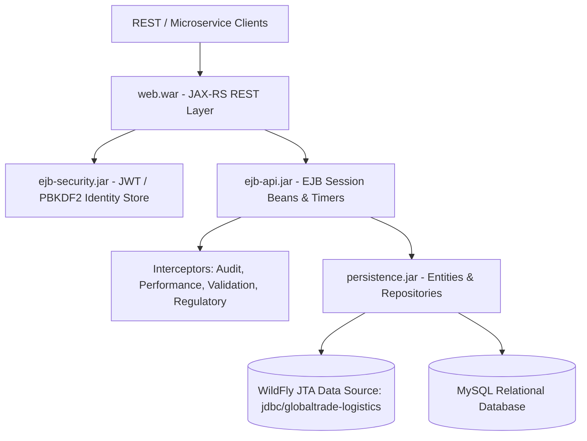
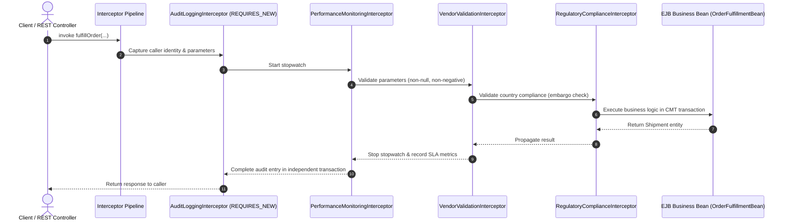

# GlobalTrade Logistics — Technical Implementation Documentation
**Coursework / Module Reference:** BCD II / Enterprise Java Beans (EJB) Architecture  
**Platform Version:** Jakarta EE 10 / WildFly Application Server  
**Target Enterprise Archive:** `globaltrade-logistics-ear.ear`  

---

## 1. Executive Summary & Architecture Overview

The **GlobalTrade Logistics** enterprise platform is a distributed, mission-critical supply chain coordination suite developed with Jakarta EE 10 and Enterprise Java Beans (EJB 3.1+). Designed for cross-border freight forwarding, maritime and air transit monitoring, automated regulatory customs compliance, and vendor performance management, the application enforces high concurrency, strong consistency, and container-managed resilience across all transactions.

### 1.1 Multi-Module Reactor Architecture
The enterprise system is organized into decoupled Maven modules according to enterprise separation of concerns:
```
GlobalTrade Logistics (Root POM)
├── persistence (JPA 3.1, Hibernate ORM 6.6, JTA Data Source)
├── ejb-security (Jakarta Security 3.0, JWT Tokens, PBKDF2 Password Hashing)
├── ejb-api (Enterprise Java Beans: Stateless, Stateful, Singleton, Timers, Interceptors, CMT/BMT)
├── web (Jakarta RESTful Web Services 3.1 JAX-RS, Endpoints, DTOs)
└── ear (Enterprise Archive Packaging: globaltrade-logistics-ear.ear)
```



---

## 2. EJB Session Bean Design & Implementations

The core business logic leverages all three primary EJB session bean paradigms along with Local and Remote business interfaces:

### 2.1 Stateless Session Beans (`@Stateless`)
Stateless session beans handle idempotent and transactional supply chain workflows with minimal resource overhead.

1. **[`ShipmentTrackingBean`](file:///D:/Projects/bcd%202/GlobalTrade%20Logistics/ejb-api/src/main/java/lk/raminsenanayake/globaltrade_logistics/ejb_api/service/impl/ShipmentTrackingBean.java)**:
   - Implements both [`ShipmentTrackingServiceLocal`](file:///D:/Projects/bcd%202/GlobalTrade%20Logistics/ejb-api/src/main/java/lk/raminsenanayake/globaltrade_logistics/ejb_api/service/ShipmentTrackingServiceLocal.java) (intra-EAR collocated calls) and [`ShipmentTrackingServiceRemote`](file:///D:/Projects/bcd%202/GlobalTrade%20Logistics/ejb-api/src/main/java/lk/raminsenanayake/globaltrade_logistics/ejb_api/service/ShipmentTrackingServiceRemote.java) (cross-network RMI-IIOP invocation).
   - Manages shipment creation, milestone updates, dynamic ETA recalculation, and vendor assignments.
   - Enforces Container-Managed Transactions (`REQUIRED` for write operations; `SUPPORTS` for read queries).
   - Combines declarative security (`@RolesAllowed`) with programmatic caller verification (`SessionContext.isCallerInRole`).

2. **[`CustomsComplianceBean`](file:///D:/Projects/bcd%202/GlobalTrade%20Logistics/ejb-api/src/main/java/lk/raminsenanayake/globaltrade_logistics/ejb_api/service/impl/CustomsComplianceBean.java)**:
   - Exposes [`CustomsComplianceServiceLocal`](file:///D:/Projects/bcd%202/GlobalTrade%20Logistics/ejb-api/src/main/java/lk/raminsenanayake/globaltrade_logistics/ejb_api/service/CustomsComplianceServiceLocal.java) and [`CustomsComplianceServiceRemote`](file:///D:/Projects/bcd%202/GlobalTrade%20Logistics/ejb-api/src/main/java/lk/raminsenanayake/globaltrade_logistics/ejb_api/service/CustomsComplianceServiceRemote.java).
   - Automated tariff and customs duty calculation based on destination trade jurisdiction (0% domestic, 5% standard international, 7.5% Tier-1 trade zones like USA/DEU).
   - Electronic customs declaration filing, status reviews, and officer clearance workflows.

3. **[`OrderFulfillmentBean`](file:///D:/Projects/bcd%202/GlobalTrade%20Logistics/ejb-api/src/main/java/lk/raminsenanayake/globaltrade_logistics/ejb_api/service/impl/OrderFulfillmentBean.java)**:
   - Coordinates complex multi-phase logistics fulfillment: inventory reservation & atomic decrement, shipment generation, and cross-border customs filing.
   - Leverages CMT transaction boundary orchestration:
     - `@TransactionAttribute(TransactionAttributeType.REQUIRED)` on `fulfillOrder(...)`.
     - `@TransactionAttribute(TransactionAttributeType.MANDATORY)` on `verifyAndDeductStockAtomic(...)`.
   - If stock is insufficient, triggers an `@ApplicationException(rollback = true)` (`InsufficientInventoryException`), automatically reverting all database writes.

4. **[`RouteOptimizationBean`](file:///D:/Projects/bcd%202/GlobalTrade%20Logistics/ejb-api/src/main/java/lk/raminsenanayake/globaltrade_logistics/ejb_api/service/impl/RouteOptimizationBean.java)**:
   - Computes multimodal logistics routing: `ROAD_EXPRESS` (domestic), `MARITIME_HAZMAT` (hazardous freight), `OCEAN_FREIGHT` (heavy freight >500kg), and `AIR_FREIGHT` (express freight).
   - Estimates transit transit hours, freight rate calculations, and carbon emission footprints.

5. **[`VendorEvaluationBean`](file:///D:/Projects/bcd%202/GlobalTrade%20Logistics/ejb-api/src/main/java/lk/raminsenanayake/globaltrade_logistics/ejb_api/service/impl/VendorEvaluationBean.java)**:
   - Computes vendor performance KPIs, on-time delivery rates, and weighted quality ratings (60% timeliness + 40% feedback score).
   - Updates compliance statuses (`COMPLIANT`, `UNDER_REVIEW`, `SUSPENDED`).

### 2.2 Stateful Session Bean (`@Stateful`)
- **[`ShipmentBookingSessionBean`](file:///D:/Projects/bcd%202/GlobalTrade%20Logistics/ejb-api/src/main/java/lk/raminsenanayake/globaltrade_logistics/ejb_api/service/impl/ShipmentBookingSessionBean.java)**:
  - Preserves conversational client state across a multi-step shipment booking journey:
    1. `initBooking(sender, origin, destination)`
    2. `addFreightItem(sku, name, quantity, unitPrice, weight)`
    3. `setCarrierAndHazardous(carrier, isHazardous)`
    4. `getBookingSummary()`
    5. `confirmAndDispatch()` (annotated with `@Remove`)
    6. `cancelBooking()` (annotated with `@Remove`)
  - Full EJB Lifecycle Callbacks implemented:
    - `@PostConstruct`: Allocates unique conversational session GUID and sets initial state.
    - `@PrePassivate`: Serializes state prior to container passivation to secondary storage.
    - `@PostActivate`: Restores state upon container reactivation.
    - `@PreDestroy`: Cleans up active conversational resources when removed.

### 2.3 Singleton Session Bean (`@Singleton`, `@Startup`)
- **[`SupplyChainMonitoringBean`](file:///D:/Projects/bcd%202/GlobalTrade%20Logistics/ejb-api/src/main/java/lk/raminsenanayake/globaltrade_logistics/ejb_api/service/impl/SupplyChainMonitoringBean.java)**:
  - Startup bean instantiated upon application deployment (`@Startup`).
  - Bootstraps baseline system data via [`DataInitializerService`](file:///D:/Projects/bcd%202/GlobalTrade%20Logistics/persistence/src/main/java/lk/raminsenanayake/globaltrade_logistics/persistence/service/DataInitializerService.java).
  - Configured with Container-Managed Concurrency (`@ConcurrencyManagement(ConcurrencyManagementType.CONTAINER)`):
    - Concurrent read access using `@Lock(LockType.READ)` for `getSystemStatus()`, `getUnacknowledgedAlerts()`, and `getRecentPerformanceMetrics()`.
    - Mutex write access using `@Lock(LockType.WRITE)` for `acknowledgeAlert()`.

---

## 3. EJB Interceptor Architecture

A comprehensive interceptor pipeline decorates business beans, executing orthogonal cross-cutting concerns:



1. **[`AuditLoggingInterceptor`](file:///D:/Projects/bcd%202/GlobalTrade%20Logistics/ejb-api/src/main/java/lk/raminsenanayake/globaltrade_logistics/ejb_api/interceptor/AuditLoggingInterceptor.java)**:
   - Inspects `SessionContext` for caller principal and assigned roles (`ADMIN`, `LOGISTIC_PERSONNEL`, etc.).
   - Persists audit trail records using [`AuditLogPersistenceService`](file:///D:/Projects/bcd%202/GlobalTrade%20Logistics/persistence/src/main/java/lk/raminsenanayake/globaltrade_logistics/persistence/service/AuditLogPersistenceService.java) under `TransactionAttributeType.REQUIRES_NEW`. This guarantees audit entries are permanently saved even if the parent business transaction encounters an exception and rolls back.

2. **[`VendorValidationInterceptor`](file:///D:/Projects/bcd%202/GlobalTrade%20Logistics/ejb-api/src/main/java/lk/raminsenanayake/globaltrade_logistics/ejb_api/interceptor/VendorValidationInterceptor.java)**:
   - Validates method arguments before execution: prevents null values, empty strings, negative numerical values, and ensures 3-letter ISO country codes. Throws [`ValidationException`](file:///D:/Projects/bcd%202/GlobalTrade%20Logistics/ejb-api/src/main/java/lk/raminsenanayake/globaltrade_logistics/ejb_api/exception/ValidationException.java) on breach.

3. **[`PerformanceMonitoringInterceptor`](file:///D:/Projects/bcd%202/GlobalTrade%20Logistics/ejb-api/src/main/java/lk/raminsenanayake/globaltrade_logistics/ejb_api/interceptor/PerformanceMonitoringInterceptor.java)**:
   - Calculates elapsed wall-clock execution time in milliseconds. Records historical metrics via [`PerformanceMetricPersistenceService`](file:///D:/Projects/bcd%202/GlobalTrade%20Logistics/persistence/src/main/java/lk/raminsenanayake/globaltrade_logistics/persistence/service/PerformanceMetricPersistenceService.java).
   - Generates SLA violation warnings in the server log whenever an operation exceeds 250ms.

4. **[`RegulatoryComplianceInterceptor`](file:///D:/Projects/bcd%202/GlobalTrade%20Logistics/ejb-api/src/main/java/lk/raminsenanayake/globaltrade_logistics/ejb_api/interceptor/RegulatoryComplianceInterceptor.java)**:
   - Intercepts origin and destination parameters against international trade sanctions lists (e.g., sanctioned countries like `PRK`, `IRN`, `SYR`, `CUB`). Throws [`TradeComplianceViolationException`](file:///D:/Projects/bcd%202/GlobalTrade%20Logistics/ejb-api/src/main/java/lk/raminsenanayake/globaltrade_logistics/ejb_api/exception/TradeComplianceViolationException.java).

5. **[`SecurityAuthorizationInterceptor`](file:///D:/Projects/bcd%202/GlobalTrade%20Logistics/ejb-api/src/main/java/lk/raminsenanayake/globaltrade_logistics/ejb_api/interceptor/SecurityAuthorizationInterceptor.java)**:
   - Enforces security checks preventing anonymous callers from invoking privileged trade business logic.

---

## 4. EJB Timer Services

Both declarative and programmatic scheduling mechanisms are unified in [`LogisticsSchedulerBean`](file:///D:/Projects/bcd%202/GlobalTrade%20Logistics/ejb-api/src/main/java/lk/raminsenanayake/globaltrade_logistics/ejb_api/service/impl/LogisticsSchedulerBean.java):

### 4.1 Declarative Timers (`@Schedule`)
| Method | Cron / Schedule Expression | Persistence | Purpose |
| :--- | :--- | :--- | :--- |
| `checkShipmentDelays()` | `second = "*/30"` | Non-persistent | Scans in-transit shipments past estimated delivery, marks status as `DELAYED`, and generates automated alerts. |
| `monitorInventoryLevels()` | `minute = "*/2"` | Non-persistent | Identifies stock falling below reorder threshold and flags shortage alerts for warehouse procurement. |
| `trackCustomsDeadlines()` | `minute = "*/5"` | Non-persistent | Tracks cross-border declarations within 12 hours of the 48-hour filing deadline and raises critical alerts. |
| `evaluateVendorPerformance()`| `hour = "0", minute = "0"` | Non-persistent | Daily recalculation of vendor on-time delivery rates and compliance standing. |
| `refreshRouteOptimizations()` | `minute = "*/10"` | Non-persistent | Refreshes global multimodal route and carrier tariff cache. |

### 4.2 Programmatic Timers (`TimerService` & `@Timeout`)
- Injects `@Resource private TimerService timerService`.
- Exposes `scheduleCustomsFilingDeadline(declarationNumber, timeoutSeconds)` and `schedulePriorityShipmentEscalation(trackingNumber, timeoutSeconds)` using `TimerConfig`.
- `@Timeout public void onTimeoutCallback(Timer timer)`:
  - Handles programmatic timer expirations.
  - Automatically dispatches high-severity alerts (`SupplyChainAlert`) into the persistence layer.

---

## 5. Transaction Management: CMT & BMT

### 5.1 Container-Managed Transactions (CMT)
The application utilizes explicit transaction attributes to control transactional scope across business beans:
- `REQUIRED`: Applied on `createShipment`, `updateShipmentStatus`, `fulfillOrder`, `fileDeclaration`, `reviewDeclaration`. Participates in existing JTA transaction or starts a new one.
- `REQUIRES_NEW`: Applied on `AuditLogPersistenceServiceImpl.logAudit` and `AlertPersistenceServiceImpl.recordAlert`. Runs in an autonomous physical database transaction independent of caller rollbacks.
- `MANDATORY`: Applied on `OrderFulfillmentBean.verifyAndDeductStockAtomic`. Guarantees that stock can only be deducted inside a verified, active caller transaction.
- `SUPPORTS`: Applied on all read/query methods (`getAllShipments`, `getDeclaration`, `getSystemStatus`) for lightweight, non-transactional execution.

### 5.2 Bean-Managed Transactions (BMT)
- Implemented in [`BatchLogisticsBean`](file:///D:/Projects/bcd%202/GlobalTrade%20Logistics/ejb-api/src/main/java/lk/raminsenanayake/globaltrade_logistics/ejb_api/service/impl/BatchLogisticsBean.java) via `@TransactionManagement(TransactionManagementType.BEAN)`.
- Injects `@Resource private UserTransaction utx;`.
- Enables explicit demarcation for bulk operations:
  - `executeBatchReplenishment(amount)`: Loops through depleted inventory items, executing `utx.begin()` and `utx.commit()` per item. If an individual item update fails, invokes `utx.rollback()` and records the error message without aborting the remainder of the batch.
  - `executeBatchShipmentDispatch(trackingNumbers)`: Demarcates atomic batch dispatches with rollback recovery.

---

## 6. Security Architecture & Role-Based Access Control

The security model bridges Jakarta Security with EJB declarative and programmatic authorizations across 5 operational roles:
- `ADMIN`: Full platform access, user management, vendor onboarding, batch overrides.
- `LOGISTIC_PERSONNEL`: Shipment booking, carrier assignment, inventory restocking, monitoring.
- `CUSTOM_OFFICIAL`: Inspection, duty approvals, and clearance of international declarations.
- `VENDOR`: View and update status of shipments specifically assigned to their vendor account.
- `CUSTOMER`: Create shipments, manage conversational bookings, and track personal shipments.

### 6.1 Declarative Security
- Annotated session beans declare supported roles: `@DeclareRoles({"ADMIN", "LOGISTIC_PERSONNEL", "VENDOR", "CUSTOM_OFFICIAL", "CUSTOMER"})`.
- Method-level gating via `@RolesAllowed({"ADMIN", "LOGISTIC_PERSONNEL"})`.

### 6.2 Programmatic Security
- Programmatic access control via `SessionContext`:
  - In `ShipmentTrackingBean.getShipmentByTrackingNumber`: Verifies that callers with the `CUSTOMER` role can only access shipments where `caller.getName().equals(shipment.getSenderUsername())`.
  - In `ShipmentTrackingBean.updateShipmentStatus`: Checks that callers with the `VENDOR` role are authorized strictly for shipments assigned to their vendor identifier.
  - Throws standard `jakarta.ejb.EJBAccessException` if caller fails ownership checks.

---

## 7. RESTful Web Services & Endpoints Reference

Base Path: `/api` (configured in `RestApplication.java`)

| Resource | HTTP Method | Path | Required Role | Description |
| :--- | :--- | :--- | :--- | :--- |
| **Auth** | `POST` | `/auth/login` | Public | Authenticates credentials and issues JWT tokens. |
| | `POST` | `/auth/refresh` | Public | Issues new access token from refresh token. |
| | `POST` | `/auth/register` | Public / Admin | Registers new user account with specified role. |
| | `GET` | `/auth/users` | Admin | Returns list of registered users. |
| **Inventory** | `GET` | `/inventory` | Public / Authenticated | Lists all inventory items. |
| | `GET` | `/inventory/{sku}` | Public / Authenticated | Fetches inventory details by SKU. |
| | `GET` | `/inventory/low-stock` | Logistics / Admin | Lists items below reorder threshold. |
| | `POST` | `/inventory` | Logistics / Admin | Registers a new inventory SKU. |
| | `POST` | `/inventory/{sku}/restock` | Logistics / Admin | Restocks item inventory. |
| **Shipments**| `POST` | `/shipments` | Customer / Logistics | Creates a new shipment order. |
| | `GET` | `/shipments` | Logistics / Admin | Lists all shipments. |
| | `GET` | `/shipments/{trackingNumber}` | Authenticated | Retrieves shipment tracking details. |
| | `PUT` | `/shipments/{trackingNumber}/status` | Vendor / Logistics | Updates milestone status and notes. |
| | `PUT` | `/shipments/{trackingNumber}/assign-vendor` | Logistics / Admin | Assigns partner carrier vendor. |
| | `DELETE`| `/shipments/{trackingNumber}` | Logistics / Admin | Cancels shipment. |
| **Customs** | `POST` | `/customs` | Logistics / Admin | Files an electronic customs declaration. |
| | `GET` | `/customs` | Customs / Logistics | Lists all filed customs declarations. |
| | `GET` | `/customs/{decNumber}`| Customs / Logistics | Retrieves specific declaration details. |
| | `PUT` | `/customs/{decNumber}/review` | Customs Official | Approves, inspects, or rejects declaration. |
| **Vendors** | `GET` | `/vendors` | Logistics / Admin | Lists partner freight vendors. |
| | `POST` | `/vendors` | Admin | Registers a new vendor partner. |
| | `GET` | `/vendors/{code}` | Authenticated | Retrieves vendor KPI metrics. |
| | `POST` | `/vendors/{code}/evaluate` | Logistics / Admin | Evaluates and updates vendor KPIs. |
| **Routes** | `GET` | `/routes/optimize` | Authenticated | Multimodal route calculations. |
| **Monitoring**| `GET` | `/monitoring/status` | Authenticated | System KPI health status summary. |
| | `GET` | `/monitoring/alerts` | Logistics / Admin | Unacknowledged supply chain alerts. |
| | `POST` | `/monitoring/alerts/{id}/ack` | Logistics / Admin | Acknowledges an active alert. |
| | `GET` | `/monitoring/metrics` | Logistics / Admin | Execution latency and SLA metrics. |
| | `POST` | `/monitoring/timers/trigger-delays` | Logistics / Admin | Manual trigger for delay check timer. |
| | `POST` | `/monitoring/timers/schedule-deadline` | Logistics / Admin | Programmatic escalation timer. |
| **Batch BMT**| `POST` | `/batch/replenish` | Logistics / Admin | BMT batch inventory replenishment. |
| | `POST` | `/batch/dispatch` | Logistics / Admin | BMT batch shipment dispatch. |
| **Stateful**| `POST` | `/booking/start` | Customer / Logistics | Starts stateful booking session. |
| | `POST` | `/booking/{sessionId}/items` | Customer / Logistics | Adds item to booking cart. |
| | `POST` | `/booking/{sessionId}/carrier` | Customer / Logistics | Sets carrier & hazardous cargo. |
| | `GET` | `/booking/{sessionId}/summary` | Customer / Logistics | Reviews current booking state. |
| | `POST` | `/booking/{sessionId}/confirm` | Customer / Logistics | Confirms and ends session (`@Remove`). |
| | `DELETE`| `/booking/{sessionId}` | Customer / Logistics | Cancels and destroys session (`@Remove`).|
