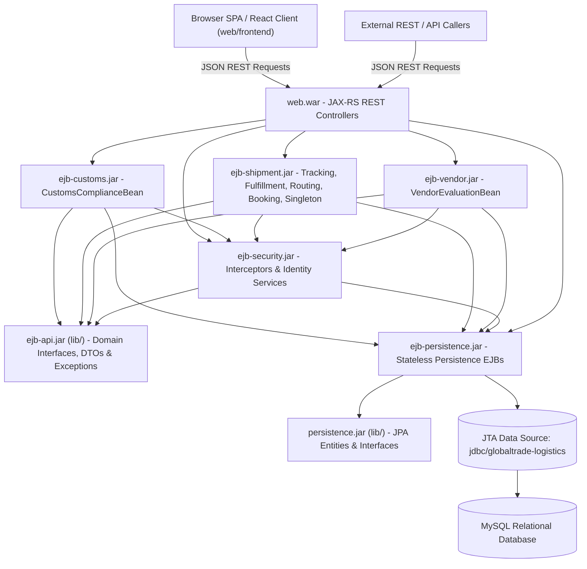
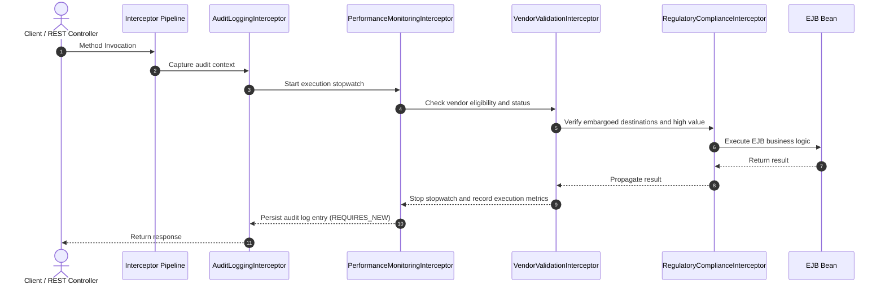

# GlobalTrade Logistics — Technical Implementation Documentation
**Coursework / Module Reference:** BCD II / Enterprise Java Beans (EJB) Architecture  
**Platform Version:** Jakarta EE 10 / GlassFish 7.0.25 (Java 17)  
**Target Enterprise Archive:** `globaltrade-logistics-ear.ear`  

---

## 1. Executive Summary & Architecture Overview

The **GlobalTrade Logistics** enterprise platform is a distributed, mission-critical supply chain coordination suite developed with Jakarta EE 10, Enterprise Java Beans (EJB 3.1+), and modern web standards. Designed for cross-border freight forwarding, multimodal transit monitoring, automated regulatory customs compliance, stateful multi-step booking sessions, batch cargo dispatching, vendor performance management, and warehouse inventory control, the platform guarantees high concurrency, ACID transaction consistency, and container-managed resilience.

### 1.1 Multi-Module Reactor Architecture
The enterprise system is organized into ten Maven modules with strict separation of concerns across persistence entities, transactional persistence EJBs, API contracts, security/interceptors, domain-specific EJB business logic, web REST layer, React frontend SPA, and EAR packaging:

```
GlobalTrade Logistics (Root POM)
├── persistence/        # JPA 3.1 Entities, Enums, Service Interfaces & persistence.xml (JAR in lib/)
├── ejb-persistence/    # EJB 3.1 Stateless Persistence Service implementations (EJB-JAR)
├── ejb-api/            # Domain-specific Local Interfaces, Exceptions, Lombok DTOs (JAR in lib/)
├── ejb-security/       # Interceptors (Audit, Compliance, Performance, Validation), JWT & Security (EJB-JAR)
├── ejb-customs/        # Customs compliance business logic & workflows (EJB-JAR)
├── ejb-shipment/       # Shipment tracking, routing, fulfillment, booking, scheduler (EJB-JAR)
├── ejb-vendor/         # Vendor evaluation, KPI scorecards, lifecycle management (EJB-JAR)
├── web/                # Jakarta RESTful Web Services 3.1 (JAX-RS) Endpoints & Controllers (WAR)
│   └── frontend/       # React 18, Vite, Tailwind CSS Single Page Application (SPA)
└── ear/                # Enterprise Archive Packaging (globaltrade-logistics-ear.ear)
```



---

## 2. EJB Session Bean Design & Domain Module Implementations

The platform leverages Stateless, Stateful, and Singleton session bean lifecycles:

### 2.1 Customs Compliance Module (`ejb-customs`)
- **[`CustomsComplianceBean`](file:///D:/Projects/bcd%202/GlobalTrade%20Logistics/ejb-customs/src/main/java/lk/raminsenanayake/globaltrade_logistics/ejb_customs/service/CustomsComplianceBean.java)** (`@Stateless`):
  - Implements [`CustomsComplianceServiceLocal`](file:///D:/Projects/bcd%202/GlobalTrade%20Logistics/ejb-api/src/main/java/lk/raminsenanayake/globaltrade_logistics/ejb_api/customs/CustomsComplianceServiceLocal.java).
  - Handles electronic filing of customs declarations (`submitDeclaration`).
  - Generates auto-sequenced declaration numbers (`DEC-...`), sets 72-hour filing deadlines, and transitions shipment status to `PENDING_CLEARANCE`.
  - Conducts officer reviews (`reviewDeclaration`): updates declaration status to `APPROVED` (transitioning shipment to `IN_TRANSIT`) or `REJECTED` (placing shipment on `CUSTOMS_HOLD` and raising high-severity `CUSTOMS_HOLD` alerts).
  - Provides queries for pending declarations and approaching deadline declarations.
  - Decorated with interceptors: `@Interceptors({AuditLoggingInterceptor.class, RegulatoryComplianceInterceptor.class, PerformanceMonitoringInterceptor.class})`.

---

### 2.2 Shipment & Logistics Module (`ejb-shipment`)

1. **[`ShipmentTrackingBean`](file:///D:/Projects/bcd%202/GlobalTrade%20Logistics/ejb-shipment/src/main/java/lk/raminsenanayake/globaltrade_logistics/ejb_shipment/service/ShipmentTrackingBean.java)** (`@Stateless`):
   - Implements [`ShipmentTrackingServiceLocal`](file:///D:/Projects/bcd%202/GlobalTrade%20Logistics/ejb-api/src/main/java/lk/raminsenanayake/globaltrade_logistics/ejb_api/shipment/ShipmentTrackingServiceLocal.java).
   - Manages shipment creation with tracking number generation (`GTL-...`), item association, milestone updates (`updateShipmentStatus`), sender queries, and potential delay scanning (`detectPotentialDelays`).
   - Decorated with `@Interceptors({AuditLoggingInterceptor.class, RegulatoryComplianceInterceptor.class, PerformanceMonitoringInterceptor.class})`.

2. **[`OrderFulfillmentBean`](file:///D:/Projects/bcd%202/GlobalTrade%20Logistics/ejb-shipment/src/main/java/lk/raminsenanayake/globaltrade_logistics/ejb_shipment/service/OrderFulfillmentBean.java)** (`@Stateless`):
   - Implements [`OrderFulfillmentServiceLocal`](file:///D:/Projects/bcd%202/GlobalTrade%20Logistics/ejb-api/src/main/java/lk/raminsenanayake/globaltrade_logistics/ejb_api/shipment/OrderFulfillmentServiceLocal.java).
   - Coordinates inventory validation, atomic stock deduction, safety reorder threshold alerts (`INVENTORY_SHORTAGE`), and automated shipment generation with status `IN_TRANSIT`.
   - Throws [`InsufficientInventoryException`](file:///D:/Projects/bcd%202/GlobalTrade%20Logistics/ejb-api/src/main/java/lk/raminsenanayake/globaltrade_logistics/ejb_api/exception/InsufficientInventoryException.java) (annotated with `@ApplicationException(rollback = true)`) on stock deficits.

3. **[`RouteOptimizationBean`](file:///D:/Projects/bcd%202/GlobalTrade%20Logistics/ejb-shipment/src/main/java/lk/raminsenanayake/globaltrade_logistics/ejb_shipment/service/RouteOptimizationBean.java)** (`@Stateless`):
   - Implements [`RouteOptimizationServiceLocal`](file:///D:/Projects/bcd%202/GlobalTrade%20Logistics/ejb-api/src/main/java/lk/raminsenanayake/globaltrade_logistics/ejb_api/shipment/RouteOptimizationServiceLocal.java).
   - Analyzes multimodal logistics routes: `AIR` (`DHL-EXPRESS`, `FEDEX-CARGO`), `SEA` (`MAERSK-OCEAN`), and `RAIL` (`EURASIA-RAIL`).
   - Dynamically evaluates optimal paths based on priority filters: `COST` (cheapest rate), `SPEED` (fastest transit time), `EMISSION` / `ECO` (lowest carbon footprint), and `RELIABILITY` (lowest risk score).
   - Returns [`RouteResult`](file:///D:/Projects/bcd%202/GlobalTrade%20Logistics/ejb-api/src/main/java/lk/raminsenanayake/globaltrade_logistics/ejb_api/dto/RouteResult.java) and [`RouteOption`](file:///D:/Projects/bcd%202/GlobalTrade%20Logistics/ejb-api/src/main/java/lk/raminsenanayake/globaltrade_logistics/ejb_api/dto/RouteOption.java) DTOs.

4. **[`BatchLogisticsBean`](file:///D:/Projects/bcd%202/GlobalTrade%20Logistics/ejb-shipment/src/main/java/lk/raminsenanayake/globaltrade_logistics/ejb_shipment/service/BatchLogisticsBean.java)** (`@Stateless`):
   - Implements [`BatchLogisticsServiceLocal`](file:///D:/Projects/bcd%202/GlobalTrade%20Logistics/ejb-api/src/main/java/lk/raminsenanayake/globaltrade_logistics/ejb_api/shipment/BatchLogisticsServiceLocal.java).
   - High-throughput processing of batch dispatches (`processBatchDispatch`) consuming `List<BatchDispatchItem>` and returning [`BatchDispatchResult`](file:///D:/Projects/bcd%202/GlobalTrade%20Logistics/ejb-api/src/main/java/lk/raminsenanayake/globaltrade_logistics/ejb_api/dto/BatchDispatchResult.java).
   - Generates consolidated shipment manifests (`generateConsolidatedManifest`) with total weight and declared value summaries.

5. **[`ShipmentBookingSessionBean`](file:///D:/Projects/bcd%202/GlobalTrade%20Logistics/ejb-shipment/src/main/java/lk/raminsenanayake/globaltrade_logistics/ejb_shipment/service/ShipmentBookingSessionBean.java)** (`@Stateful`):
   - Implements [`ShipmentBookingServiceLocal`](file:///D:/Projects/bcd%202/GlobalTrade%20Logistics/ejb-api/src/main/java/lk/raminsenanayake/globaltrade_logistics/ejb_api/shipment/ShipmentBookingServiceLocal.java).
   - Preserves conversational client booking state across multi-step flows:
     1. `startBooking(sender, origin, destination)`
     2. `addItem(sku, description, quantity, weightKg, declaredValue)` (maintains `List<BookingItemDto>`)
     3. `removeItem(sku)`
     4. `selectCarrier(carrierCode, serviceLevel)`
     5. `getCurrentSummary()` (returns [`BookingSummary`](file:///D:/Projects/bcd%202/GlobalTrade%20Logistics/ejb-api/src/main/java/lk/raminsenanayake/globaltrade_logistics/ejb_api/dto/BookingSummary.java))
     6. `confirmBooking()` (`@Remove`)
     7. `cancelBooking()` (`@Remove`)

6. **[`SupplyChainMonitoringBean`](file:///D:/Projects/bcd%202/GlobalTrade%20Logistics/ejb-shipment/src/main/java/lk/raminsenanayake/globaltrade_logistics/ejb_shipment/service/SupplyChainMonitoringBean.java)** (`@Singleton`, `@Startup`):
   - Implements [`SupplyChainMonitoringServiceLocal`](file:///D:/Projects/bcd%202/GlobalTrade%20Logistics/ejb-api/src/main/java/lk/raminsenanayake/globaltrade_logistics/ejb_api/shipment/SupplyChainMonitoringServiceLocal.java).
   - Bootstraps default administrative accounts and baseline demo inventory via `@PostConstruct` and [`DataInitializerService`](file:///D:/Projects/bcd%202/GlobalTrade%20Logistics/persistence/src/main/java/lk/raminsenanayake/globaltrade_logistics/persistence/service/DataInitializerService.java).
   - Container-Managed Concurrency (`@ConcurrencyManagement(CONTAINER)`):
     - Concurrent read access using `@Lock(LockType.READ)` for `getSystemStatus()` (returning [`SystemStatusSummary`](file:///D:/Projects/bcd%202/GlobalTrade%20Logistics/ejb-api/src/main/java/lk/raminsenanayake/globaltrade_logistics/ejb_api/dto/SystemStatusSummary.java)), `getUnacknowledgedAlerts()`, and `getRecentPerformanceMetrics()`.
     - Exclusive write access using `@Lock(LockType.WRITE)` for `acknowledgeAlert()`.

7. **[`LogisticsSchedulerBean`](file:///D:/Projects/bcd%202/GlobalTrade%20Logistics/ejb-shipment/src/main/java/lk/raminsenanayake/globaltrade_logistics/ejb_shipment/schedule/LogisticsSchedulerBean.java)** (`@Singleton`, `@Startup`, `@RunAs("ADMIN")`):
   - Implements [`LogisticsSchedulerServiceLocal`](file:///D:/Projects/bcd%202/GlobalTrade%20Logistics/ejb-api/src/main/java/lk/raminsenanayake/globaltrade_logistics/ejb_api/shipment/LogisticsSchedulerServiceLocal.java).
   - Periodic delay detection (`@Schedule(hour = "*", minute = "*/15", persistent = false)`).
   - Periodic customs deadline escalation (`@Schedule(hour = "*", minute = "*/30", persistent = false)`).
   - Midnight inventory restock check (`@Schedule(hour = "0", minute = "0", persistent = false)`).

---

### 2.3 Vendor Management Module (`ejb-vendor`)
- **[`VendorEvaluationBean`](file:///D:/Projects/bcd%202/GlobalTrade%20Logistics/ejb-vendor/src/main/java/lk/raminsenanayake/globaltrade_logistics/ejb_vendor/service/impl/VendorEvaluationBean.java)** (`@Stateless`):
  - Implements [`VendorEvaluationServiceLocal`](file:///D:/Projects/bcd%202/GlobalTrade%20Logistics/ejb-api/src/main/java/lk/raminsenanayake/globaltrade_logistics/ejb_api/vendor/VendorEvaluationServiceLocal.java).
  - Handles vendor registration with auto-generated vendor codes (`VND-...`).
  - Evaluates vendor performance KPIs (`evaluateVendor`): computes on-time delivery rates, performance ratings (1.0 - 5.0), and updates compliance status (`COMPLIANT`, `PROBATION`, `SUSPENDED`). Returns [`VendorScorecard`](file:///D:/Projects/bcd%202/GlobalTrade%20Logistics/ejb-api/src/main/java/lk/raminsenanayake/globaltrade_logistics/ejb_api/dto/VendorScorecard.java). Raises `VENDOR_PERFORMANCE_DEGRADED` alert when performance falls below SLA thresholds.
  - Safe vendor assignment (`assignVendorToShipment`) protected by `@Interceptors({VendorValidationInterceptor.class})`.

---

### 2.4 Transactional Persistence Services Module (`ejb-persistence`)

The `ejb-persistence` module contains Stateless Session Beans implementing transactional persistence services, injecting the JPA `EntityManager` with container-managed transactions:

- **[`ShipmentPersistenceServiceImpl`](file:///D:/Projects/bcd%202/GlobalTrade%20Logistics/ejb-persistence/src/main/java/lk/raminsenanayake/globaltrade_logistics/persistence/service/impl/ShipmentPersistenceServiceImpl.java)**: CRUD, tracking number lookup, sender queries, and status updates.
- **[`CustomsPersistenceServiceImpl`](file:///D:/Projects/bcd%202/GlobalTrade%20Logistics/ejb-persistence/src/main/java/lk/raminsenanayake/globaltrade_logistics/persistence/service/impl/CustomsPersistenceServiceImpl.java)**: Declaration lookup, pending reviews, deadline queries, and review updates.
- **[`VendorPersistenceServiceImpl`](file:///D:/Projects/bcd%202/GlobalTrade%20Logistics/ejb-persistence/src/main/java/lk/raminsenanayake/globaltrade_logistics/persistence/service/impl/VendorPersistenceServiceImpl.java)**: Vendor registration, code queries, status updates, and scorecard tracking.
- **[`InventoryPersistenceServiceImpl`](file:///D:/Projects/bcd%202/GlobalTrade%20Logistics/ejb-persistence/src/main/java/lk/raminsenanayake/globaltrade_logistics/persistence/service/impl/InventoryPersistenceServiceImpl.java)**: Stock level querying, atomic decrementing, restocking, and low-stock scanning.
- **[`UserPersistenceServiceImpl`](file:///D:/Projects/bcd%202/GlobalTrade%20Logistics/ejb-persistence/src/main/java/lk/raminsenanayake/globaltrade_logistics/persistence/service/impl/UserPersistenceServiceImpl.java)**: User credential lookups, user creation, and list queries.
- **[`AlertPersistenceServiceImpl`](file:///D:/Projects/bcd%202/GlobalTrade%20Logistics/ejb-persistence/src/main/java/lk/raminsenanayake/globaltrade_logistics/persistence/service/impl/AlertPersistenceServiceImpl.java)**: Supply chain alert creation, unacknowledged queries, and acknowledgement marking.
- **[`AuditLogPersistenceServiceImpl`](file:///D:/Projects/bcd%202/GlobalTrade%20Logistics/ejb-persistence/src/main/java/lk/raminsenanayake/globaltrade_logistics/persistence/service/impl/AuditLogPersistenceServiceImpl.java)**: Independent audit log writes using `@TransactionAttribute(TransactionAttributeType.REQUIRES_NEW)`.
- **[`PerformanceMetricPersistenceServiceImpl`](file:///D:/Projects/bcd%202/GlobalTrade%20Logistics/ejb-persistence/src/main/java/lk/raminsenanayake/globaltrade_logistics/persistence/service/impl/PerformanceMetricPersistenceServiceImpl.java)**: Execution telemetry metric recording using `REQUIRES_NEW`.
- **[`RefreshTokenPersistenceServiceImpl`](file:///D:/Projects/bcd%202/GlobalTrade%20Logistics/ejb-persistence/src/main/java/lk/raminsenanayake/globaltrade_logistics/persistence/service/impl/RefreshTokenPersistenceServiceImpl.java)**: Refresh token storage, validation, revocation, and automated expired cleanup.
- **[`DataInitializerServiceImpl`](file:///D:/Projects/bcd%202/GlobalTrade%20Logistics/ejb-persistence/src/main/java/lk/raminsenanayake/globaltrade_logistics/persistence/service/impl/DataInitializerServiceImpl.java)**: Seeding default administrative accounts, demo inventory, and initial vendor profiles on platform startup.

---

## 3. Data Transfer Objects Architecture (`ejb-api/dto`)

All Data Transfer Objects are consolidated in package [`lk.raminsenanayake.globaltrade_logistics.ejb_api.dto`](file:///D:/Projects/bcd%202/GlobalTrade%20Logistics/ejb-api/src/main/java/lk/raminsenanayake/globaltrade_logistics/ejb_api/dto) to decouple EJB local business interfaces from static nested declarations and enable uniform serialization across EJB / REST boundaries:

- **Lombok Integration**: Each DTO is annotated with `@Data`, `@NoArgsConstructor`, `@AllArgsConstructor`, `@Builder` for boilerplate reduction and clean builder pattern construction.
- **RMI & Remote Safety**: All DTOs implement `Serializable`.

| DTO Class | Key Attributes | Target Domain / Service |
| :--- | :--- | :--- |
| [`BatchDispatchItem`](file:///D:/Projects/bcd%202/GlobalTrade%20Logistics/ejb-api/src/main/java/lk/raminsenanayake/globaltrade_logistics/ejb_api/dto/BatchDispatchItem.java) | `origin`, `destination`, `senderUsername`, `carrier`, `weightKg`, `declaredValue`, `itemSku`, `itemQty` | `BatchLogisticsServiceLocal` |
| [`BatchDispatchResult`](file:///D:/Projects/bcd%202/GlobalTrade%20Logistics/ejb-api/src/main/java/lk/raminsenanayake/globaltrade_logistics/ejb_api/dto/BatchDispatchResult.java) | `totalProcessed`, `totalSucceeded`, `totalFailed`, `generatedTrackingNumbers`, `errors` | `BatchLogisticsServiceLocal` |
| [`BookingItemDto`](file:///D:/Projects/bcd%202/GlobalTrade%20Logistics/ejb-api/src/main/java/lk/raminsenanayake/globaltrade_logistics/ejb_api/dto/BookingItemDto.java) | `sku`, `description`, `quantity`, `weightKg`, `declaredValue` | `ShipmentBookingServiceLocal` |
| [`BookingSummary`](file:///D:/Projects/bcd%202/GlobalTrade%20Logistics/ejb-api/src/main/java/lk/raminsenanayake/globaltrade_logistics/ejb_api/dto/BookingSummary.java) | `senderUsername`, `origin`, `destination`, `carrierCode`, `serviceLevel`, `items`, `totalWeightKg`, `totalDeclaredValue`, `estimatedCostUSD` | `ShipmentBookingServiceLocal` |
| [`OrderItemDto`](file:///D:/Projects/bcd%202/GlobalTrade%20Logistics/ejb-api/src/main/java/lk/raminsenanayake/globaltrade_logistics/ejb_api/dto/OrderItemDto.java) | `sku`, `quantity`, `unitPrice`, `weightKg` | `OrderFulfillmentServiceLocal` |
| [`RouteOption`](file:///D:/Projects/bcd%202/GlobalTrade%20Logistics/ejb-api/src/main/java/lk/raminsenanayake/globaltrade_logistics/ejb_api/dto/RouteOption.java) | `routeId`, `transportMode`, `carrierCode`, `estimatedCostUSD`, `estimatedDays`, `carbonEmissionKg`, `riskScore` | `RouteOptimizationServiceLocal` |
| [`RouteResult`](file:///D:/Projects/bcd%202/GlobalTrade%20Logistics/ejb-api/src/main/java/lk/raminsenanayake/globaltrade_logistics/ejb_api/dto/RouteResult.java) | `origin`, `destination`, `weightKg`, `optimalRoute`, `alternativeRoutes` | `RouteOptimizationServiceLocal` |
| [`SystemStatusSummary`](file:///D:/Projects/bcd%202/GlobalTrade%20Logistics/ejb-api/src/main/java/lk/raminsenanayake/globaltrade_logistics/ejb_api/dto/SystemStatusSummary.java) | `activeShipmentsCount`, `delayedShipmentsCount`, `pendingCustomsDeclarationsCount`, `unacknowledgedAlertsCount`, `lowStockInventoryCount`, `averageExecutionTimeMs`, `systemHealthStatus` | `SupplyChainMonitoringServiceLocal` |
| [`VendorScorecard`](file:///D:/Projects/bcd%202/GlobalTrade%20Logistics/ejb-api/src/main/java/lk/raminsenanayake/globaltrade_logistics/ejb_api/dto/VendorScorecard.java) | `vendorCode`, `name`, `performanceRating`, `onTimeDeliveryRate`, `totalShipments`, `delayedShipments`, `complianceStatus`, `recommendation` | `VendorEvaluationServiceLocal` |

---

## 4. Persistence Architecture (`persistence`)

### 4.1 Entity-Relationship Structure
The persistence layer manages relational persistence across 10 core entities mapped via JPA 3.1:
- `User`: System security callers, salted password hashes, and assigned `UserRole`.
- `RefreshToken`: Cryptographic multi-session refresh tokens with expiration timestamps.
- `Inventory`: Warehouse SKUs, available quantities, unit values, and safety reorder thresholds.
- `Shipment`: Master shipment records with origin/destination country codes, routing parameters, and lifecycle `ShipmentStatus`.
- `ShipmentItem`: Line items associated with shipments (cascade-managed).
- `CustomsDeclaration`: Regulatory tariff filings, compliance status, clearance dates, and filing deadlines.
- `Vendor`: Carrier partner profiles, SLA scorecards, on-time delivery ratios, and compliance statuses.
- `SupplyChainAlert`: High-priority operational alerts with severity levels (`INFO`, `WARNING`, `CRITICAL`, `BLOCKER`).
- `AuditLog` and `PerformanceMetricRecord`: Immutable security audit logs and execution telemetry.

---

## 5. EJB Interceptor Architecture (`ejb-security`)

All system interceptors are located in package [`lk.raminsenanayake.globaltrade_logistics.ejb_security.interceptor`](file:///D:/Projects/bcd%202/GlobalTrade%20Logistics/ejb-security/src/main/java/lk/raminsenanayake/globaltrade_logistics/ejb_security/interceptor/):



1. **[`AuditLoggingInterceptor`](file:///D:/Projects/bcd%202/GlobalTrade%20Logistics/ejb-security/src/main/java/lk/raminsenanayake/globaltrade_logistics/ejb_security/interceptor/AuditLoggingInterceptor.java)**:
   - Captures class name, method name, execution parameters, and timestamps.
   - Logs details and persists audit records in `AuditLog` via [`AuditLogPersistenceService`](file:///D:/Projects/bcd%202/GlobalTrade%20Logistics/persistence/src/main/java/lk/raminsenanayake/globaltrade_logistics/persistence/service/AuditLogPersistenceService.java) using `REQUIRES_NEW` transaction isolation.

2. **[`PerformanceMonitoringInterceptor`](file:///D:/Projects/bcd%202/GlobalTrade%20Logistics/ejb-security/src/main/java/lk/raminsenanayake/globaltrade_logistics/ejb_security/interceptor/PerformanceMonitoringInterceptor.java)**:
   - Measures method execution duration in milliseconds.
   - Automatically saves telemetry in `PerformanceMetricRecord` via [`PerformanceMetricPersistenceService`](file:///D:/Projects/bcd%202/GlobalTrade%20Logistics/persistence/src/main/java/lk/raminsenanayake/globaltrade_logistics/persistence/service/PerformanceMetricPersistenceService.java).

3. **[`VendorValidationInterceptor`](file:///D:/Projects/bcd%202/GlobalTrade%20Logistics/ejb-security/src/main/java/lk/raminsenanayake/globaltrade_logistics/ejb_security/interceptor/VendorValidationInterceptor.java)**:
   - Validates vendor status when vendor codes (`VND-...`) or `Vendor` instances are passed to business methods.
   - Prevents assignment of `SUSPENDED` vendors, throwing [`VendorComplianceException`](file:///D:/Projects/bcd%202/GlobalTrade%20Logistics/ejb-api/src/main/java/lk/raminsenanayake/globaltrade_logistics/ejb_api/exception/VendorComplianceException.java).

4. **[`RegulatoryComplianceInterceptor`](file:///D:/Projects/bcd%202/GlobalTrade%20Logistics/ejb-security/src/main/java/lk/raminsenanayake/globaltrade_logistics/ejb_security/interceptor/RegulatoryComplianceInterceptor.java)**:
   - Checks origin and destination against international trade sanctions (`PRK`, `IRN`, `SYR`, `CUB`, `SDN`).
   - Automatically generates high-priority `TRADE_SANCTION_DETECTED` alerts and throws [`TradeComplianceViolationException`](file:///D:/Projects/bcd%202/GlobalTrade%20Logistics/ejb-api/src/main/java/lk/raminsenanayake/globaltrade_logistics/ejb_api/exception/TradeComplianceViolationException.java).
   - Flags shipments exceeding $100,000 USD declared value for special customs review.

5. **[`SecurityAuthorizationInterceptor`](file:///D:/Projects/bcd%202/GlobalTrade%20Logistics/ejb-security/src/main/java/lk/raminsenanayake/globaltrade_logistics/ejb_security/interceptor/SecurityAuthorizationInterceptor.java)**:
   - Programmatic security validation interceptor ensuring authorized caller execution.

---

## 6. Security & Identity Store Architecture (`ejb-security`)

- **Jakarta Security 3.0 Standard**: Implements [`AppIdentityStore`](file:///D:/Projects/bcd%202/GlobalTrade%20Logistics/ejb-security/src/main/java/lk/raminsenanayake/globaltrade_logistics/ejb_security/security/AppIdentityStore.java) and [`JwtAuthMechanism`](file:///D:/Projects/bcd%202/GlobalTrade%20Logistics/ejb-security/src/main/java/lk/raminsenanayake/globaltrade_logistics/ejb_security/security/JwtAuthMechanism.java).
- **Password Hashing**: Uses `Pbkdf2PasswordHash` for salted hash creation and verification.
- **Stateless JWT Tokens**: Signed HMAC-256 tokens carrying username and role scopes (`ADMIN`, `LOGISTIC_PERSONNEL`, `CUSTOM_OFFICIAL`, `VENDOR`, `CUSTOMER`).
- **Unified JSON Error Responses**: [`JwtAuthMechanism`](file:///D:/Projects/bcd%202/GlobalTrade%20Logistics/ejb-security/src/main/java/lk/raminsenanayake/globaltrade_logistics/ejb_security/security/JwtAuthMechanism.java) writes standardized `application/json` error payloads with status codes (`401 Unauthorized`, `403 Forbidden`) on authentication failures.
- **Token Lifecycle**: [`RefreshTokenCleanupScheduler`](file:///D:/Projects/bcd%202/GlobalTrade%20Logistics/ejb-security/src/main/java/lk/raminsenanayake/globaltrade_logistics/ejb_security/schedule/RefreshTokenCleanupScheduler.java) automatically purges expired tokens via periodic `@Schedule` timers.

---

## 7. RESTful Web Services Reference (`web`)

Base Context: `/api` (configured in [`RestApplication.java`](file:///D:/Projects/bcd%202/GlobalTrade%20Logistics/web/src/main/java/lk/raminsenanayake/globaltrade_logistics/web/RestApplication.java)). All endpoints produce and consume `application/json`.

| Domain | Method | Endpoint Path | Roles Allowed | Description |
| :--- | :--- | :--- | :--- | :--- |
| **Auth** | `POST` | `/auth/login` | Permitted | Authenticate user and issue JWT token |
| | `POST` | `/auth/refresh` | Permitted | Exchange refresh token for new access token |
| | `POST` | `/auth/register` | `ADMIN` | Register new user account |
| | `GET` | `/auth/users` | `ADMIN` | List registered system users |
| **Inventory** | `GET` | `/inventory` | Authenticated | List all inventory items |
| | `GET` | `/inventory/{sku}` | Authenticated | Get inventory item details by SKU |
| | `GET` | `/inventory/low-stock` | `ADMIN`, `LOGISTIC_PERSONNEL` | Retrieve items below safety reorder threshold |
| | `POST` | `/inventory` | `ADMIN`, `LOGISTIC_PERSONNEL` | Create a new inventory record |
| | `POST` | `/inventory/{sku}/restock` | `ADMIN`, `LOGISTIC_PERSONNEL` | Restock item quantity |
| **Shipments** | `POST` | `/shipments` | `ADMIN`, `LOGISTIC_PERSONNEL`, `CUSTOMER` | Create and register a shipment |
| | `GET` | `/shipments` | Authenticated | List all shipments |
| | `GET` | `/shipments/{trackingNumber}`| Authenticated | Retrieve shipment details |
| | `GET` | `/shipments/user/{username}` | Authenticated | Retrieve shipments by sender username |
| | `PUT` | `/shipments/{trackingNumber}/status` | `ADMIN`, `LOGISTIC_PERSONNEL` | Update milestone status |
| | `GET` | `/shipments/delays` | `ADMIN`, `LOGISTIC_PERSONNEL` | Scan for delayed shipments |
| **Customs** | `POST` | `/customs/declarations` | `ADMIN`, `CUSTOM_OFFICIAL`, `LOGISTIC_PERSONNEL` | Submit electronic customs declaration |
| | `PUT` | `/customs/declarations/{decNum}/review` | `ADMIN`, `CUSTOM_OFFICIAL` | Official approval or rejection review |
| | `GET` | `/customs/compliance/{trackingNumber}` | Authenticated | Verify customs clearance compliance |
| | `GET` | `/customs/declarations/pending` | `ADMIN`, `CUSTOM_OFFICIAL` | List pending declarations |
| | `GET` | `/customs/declarations/deadlines` | `ADMIN`, `CUSTOM_OFFICIAL` | Declarations approaching filing deadline |
| **Vendors** | `POST` | `/vendors` | `ADMIN` | Register new vendor |
| | `GET` | `/vendors` | Authenticated | List vendors (optional status filter) |
| | `POST` | `/vendors/{vendorCode}/evaluate` | `ADMIN`, `LOGISTIC_PERSONNEL` | Recalculate vendor performance scorecard |
| | `GET` | `/vendors/{vendorCode}/scorecard` | Authenticated | Retrieve vendor scorecard |
| | `POST` | `/vendors/assign` | `ADMIN`, `LOGISTIC_PERSONNEL` | Assign vendor to shipment |
| **Routes** | `GET` | `/routes/optimize` | Authenticated | Calculate optimal route (`COST`, `SPEED`, `ECO`, `RELIABILITY`) |
| | `GET` | `/routes/compare` | Authenticated | Compare multimodal routing options |
| **Stateful Booking** | `POST` | `/booking/start` | Authenticated | Start stateful shipment booking session |
| | `POST` | `/booking/items` | Authenticated | Add item to booking cart |
| | `DELETE`| `/booking/items/{sku}` | Authenticated | Remove item from booking cart |
| | `POST` | `/booking/carrier` | Authenticated | Select carrier and service level |
| | `GET` | `/booking/summary` | Authenticated | Retrieve booking summary |
| | `POST` | `/booking/confirm` | Authenticated | Confirm booking and dispatch shipment (`@Remove`) |
| | `POST` | `/booking/cancel` | Authenticated | Cancel and destroy booking session (`@Remove`) |
| **Batch Operations** | `POST` | `/batch/dispatch` | `ADMIN`, `LOGISTIC_PERSONNEL` | Batch process multiple dispatches |
| | `POST` | `/batch/manifest` | `ADMIN`, `LOGISTIC_PERSONNEL` | Generate consolidated cargo manifest |
| **Monitoring** | `GET` | `/monitoring/status` | `ADMIN`, `LOGISTIC_PERSONNEL` | System KPI health status summary |
| | `GET` | `/monitoring/alerts` | `ADMIN`, `LOGISTIC_PERSONNEL` | Retrieve unacknowledged supply chain alerts |
| | `PUT` | `/monitoring/alerts/{id}/acknowledge` | `ADMIN`, `LOGISTIC_PERSONNEL` | Acknowledge active alert |
| | `GET` | `/monitoring/metrics` | `ADMIN` | Retrieve execution telemetry metrics |

---

## 8. Frontend Single Page Application Architecture (`web/frontend`)

The user interface is built as a Single Page Application (SPA) located in `web/frontend`:

### 8.1 Technology Stack
- **Framework:** React 18 / Vite
- **Styling:** Tailwind CSS with modern cards, badges, modal dialogs, responsive tables, and theme gradients
- **Icons:** Lucide React (`lucide-react`)
- **State & Context:** React Context API for global authentication state and notification toasts

### 8.2 Component Hierarchy & Views
- **Context:** [`AuthContext.jsx`](file:///D:/Projects/bcd%202/GlobalTrade%20Logistics/web/frontend/src/context/AuthContext.jsx) manages JWT tokens, user profiles, login/logout, and token persistence in `localStorage`.
- **API Client:** [`services/api.js`](file:///D:/Projects/bcd%202/GlobalTrade%20Logistics/web/frontend/src/services/api.js) centralizes all REST invocations with automated `Authorization: Bearer <token>` injection and unified JSON error handling.
- **Views:**
  1. [`DashboardView.jsx`](file:///D:/Projects/bcd%202/GlobalTrade%20Logistics/web/frontend/src/views/DashboardView.jsx): Live KPI counters, system health indicator, unacknowledged alert feed with acknowledge button.
  2. [`ShipmentsView.jsx`](file:///D:/Projects/bcd%202/GlobalTrade%20Logistics/web/frontend/src/views/ShipmentsView.jsx): Filterable shipment table, detailed milestone tracking, delay scanner, and status update dialogs.
  3. [`BookingWizardView.jsx`](file:///D:/Projects/bcd%202/GlobalTrade%20Logistics/web/frontend/src/views/BookingWizardView.jsx): 4-step wizard consuming the `@Stateful` EJB session (Step 1: Origin/Destination/Sender → Step 2: Line Item Specification → Step 3: Multimodal Carrier Selection → Step 4: Summary, Cost Estimation, and Confirmation).
  4. [`CustomsView.jsx`](file:///D:/Projects/bcd%202/GlobalTrade%20Logistics/web/frontend/src/views/CustomsView.jsx): Customs declaration filing, review interface for customs officers (`APPROVED` / `REJECTED`), and deadline expiration alerts.
  5. [`VendorsView.jsx`](file:///D:/Projects/bcd%202/GlobalTrade%20Logistics/web/frontend/src/views/VendorsView.jsx): Vendor registration, carrier compliance badges, and automated scorecard evaluations.
  6. [`RoutesView.jsx`](file:///D:/Projects/bcd%202/GlobalTrade%20Logistics/web/frontend/src/views/RoutesView.jsx): Interactive route optimizer and side-by-side multimodal carrier comparison (`AIR`, `SEA`, `RAIL`).
  7. [`InventoryView.jsx`](file:///D:/Projects/bcd%202/GlobalTrade%20Logistics/web/frontend/src/views/InventoryView.jsx): Warehouse SKU tracker, safety threshold indicators, and restock actions.
  8. [`BatchOperationsView.jsx`](file:///D:/Projects/bcd%202/GlobalTrade%20Logistics/web/frontend/src/views/BatchOperationsView.jsx): Multi-item bulk dispatch runner and cargo manifest generator.
  9. [`UserManagementView.jsx`](file:///D:/Projects/bcd%202/GlobalTrade%20Logistics/web/frontend/src/views/UserManagementView.jsx): Role-based account creation and user administration.
  10. [`LoginView.jsx`](file:///D:/Projects/bcd%202/GlobalTrade%20Logistics/web/frontend/src/views/LoginView.jsx): Secure JWT authentication portal.

---

## 9. Enterprise Archive Packaging (`ear`)

The complete multi-module project packages into a single deployable EAR archive:
- **`globaltrade-logistics-ear.ear`**:
  - `web.war` (Web module with JAX-RS REST endpoints)
  - `ejb-persistence.jar` (Stateless persistence service session beans)
  - `ejb-security.jar` (Security, IdentityStore, and Interceptor EJB module)
  - `ejb-customs.jar` (Customs EJB module)
  - `ejb-shipment.jar` (Shipment, Routing, Fulfillment, Booking, Monitoring EJB module)
  - `ejb-vendor.jar` (Vendor Management EJB module)
  - `lib/` directory containing shared runtime libraries: `persistence.jar`, `ejb-api.jar`, `java-jwt.jar`, `jackson-databind.jar`, Hibernate ORM, and MySQL Connector/J.
